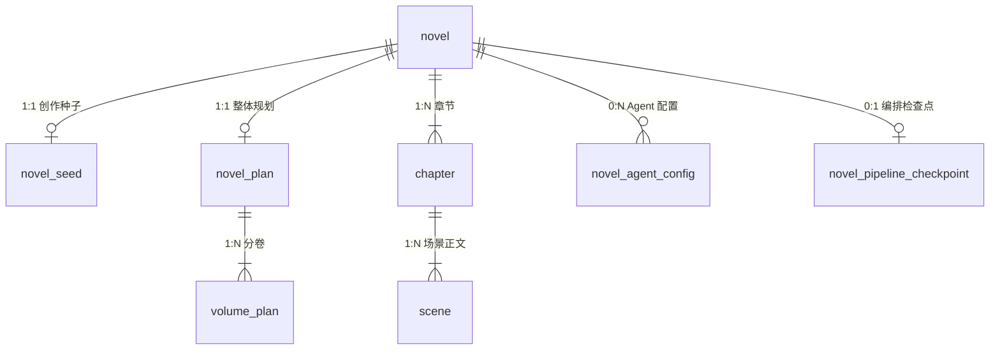
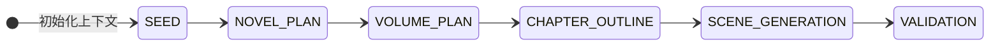
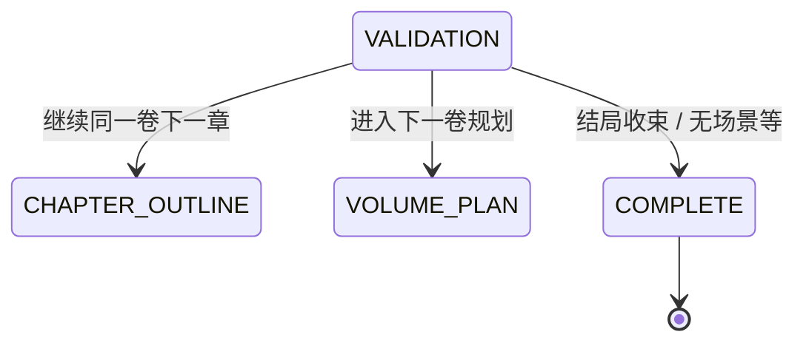
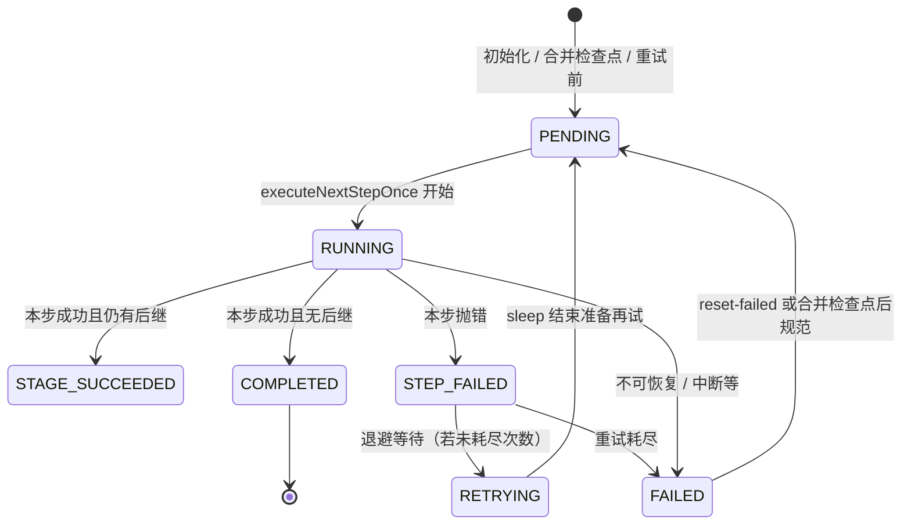
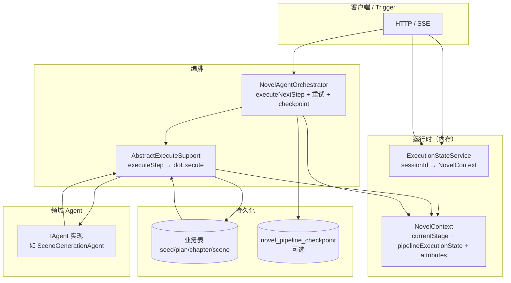
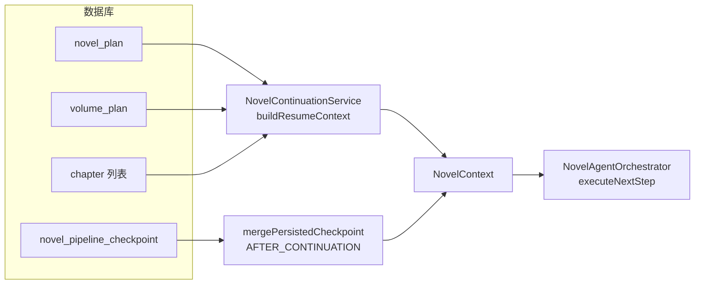

# 小说生成任务编排：责任链 + 状态机 Pipeline 设计说明

本文档说明 **多阶段 AI 小说生成** 如何通过 **统一 Handler（责任链节点）**、**业务阶段枚举（`GenerationStage`）**、**编排生命周期（`PipelineExecutionState`）**、**编排器分步执行**、**阶段级指数退避重试**、**可选库表检查点** 与 **业务库表** 协同工作；并给出 **状态转化图** 与 **数据流图**。

> **持久化分工（当前实现）**  
> - **业务进度**：仍以 `novel_id` 串联 `novel_seed`、`novel_plan`、`volume_plan`、`chapter`、`scene` 等；续写时 **`NovelContinuationService`** 根据已落库数据 **推断** `currentStage`。  
> - **编排末态（跨会话/重启）**：表 **`novel_pipeline_checkpoint`**（一书一行），在 **`novel.pipeline.checkpoint.enabled=true`** 时由 **`NovelAgentOrchestrator`** 在 `executeNextStep` 的 **`finally`** 等路径 **`upsert`**；启动时 **`mergePersistedCheckpoint`** 与内存上下文合并。  
> - **单次 HTTP/SSE 会话**：**`ExecutionStateService`** 内 **`sessionId → NovelContext`**（内存），与 SSE 绑定；进程重启后依赖 **检查点 + 业务推导** 恢复。

---

## 1. 库表设计（与 Pipeline 的对应关系）

业务表按 **创作产物层级** 组织，与责任链各阶段产出一致：`novel` → `novel_seed` → `novel_plan` / `volume_plan` → `chapter` → `scene`。可选配置见 `novel_agent_config`。

### 1.1 ER 关系（逻辑）



### 1.2 核心表字段摘要

| 表名 | 业务含义 | 与 Pipeline 阶段的关联 |
|------|----------|----------------------|
| `novel` | 小说主档 | 全局 `novel_id` |
| `novel_seed` | 种子（题材、冲突、世界观等） | **SEED** 阶段持久化 |
| `novel_plan` | 全书规划（总卷数、每卷章数、总纲） | **NOVEL_PLAN** |
| `volume_plan` | 分卷主题、本章数 | **VOLUME_PLAN** |
| `chapter` | 章梗概、正文、字数、状态 | **CHAPTER_OUTLINE** / **SCENE_GENERATION** |
| `scene` | 场景级正文与元数据 | **SCENE_GENERATION** 细粒度落库 |
| `novel_agent_config` | Agent 级别 KV 配置 | 扩展行为，非阶段状态表 |
| **`novel_pipeline_checkpoint`** | **一书一行末次编排快照** | **`current_stage` + `pipeline_execution_state` + 末次失败信息** |

完整 DDL 可参考：

- `docs/dev-ops/mysql/sql/novel-agent.sql`（含 `novel_pipeline_checkpoint`）
- PostgreSQL / pgvector：`docs/dev-ops/pgvector/init.sql`（**以脚本为准**）

### 1.3 表 `novel_pipeline_checkpoint`（编排检查点）

| 字段 | 说明 |
|------|------|
| `novel_id` | 唯一键（一书一行） |
| `session_id` | 可选，来自 `NovelContext` 属性 `NovelContextKeys.SESSION_ID`（SSE 会话） |
| `current_stage` | 与 `GenerationStage.name()` 等业务阶段字符串一致 |
| `pipeline_execution_state` | `PipelineExecutionState.name()` |
| `last_failure_message` | 与 `NovelContextKeys.LAST_STAGE_FAILURE_MESSAGE` 对齐 |
| `update_time` | 末次写入时间 |

MyBatis：`ai-agent-station-study-app/.../mybatis/mapper/novel_pipeline_checkpoint_mapper.xml`（**`upsert` 当前为 PostgreSQL `ON CONFLICT (novel_id)` 写法**）。

仓储实现：`NovelPipelineCheckpointRepository`（**`@ConditionalOnProperty(name = "novel.pipeline.checkpoint.enabled", havingValue = "true")`**）。

### 1.4 「阶段与编排状态」如何持久化与恢复

| 维度 | 存储方式 | 说明 |
|------|----------|------|
| 长期业务进度 | **推导式**：`novel_plan` / `volume_plan` / `chapter` | `NovelContinuationService#buildResumeContext` → `resolveResumePointer` |
| **编排末态（可选）** | **`novel_pipeline_checkpoint`** | `INovelPipelineCheckpointRepository#upsert` / `findByNovelId`；**`NovelAgentOrchestrator#mergePersistedCheckpoint`** |
| 单次会话 | `ExecutionStateService`：`sessionId → NovelContext` | 重启丢失；人机协同分步 |
| 内存字段 | `NovelContext.currentStage` + **`pipelineExecutionState`** + `attributes` | 编排器 `getNodeByStage` 解析节点；**preflight** 拦截终态 / **RETRYING** |

**合并策略（`PipelineCheckpointMergeMode`）**

- **`FRESH_SESSION`**：在 **`initializeContext` 之后**调用（如 `NovelController` 新建生成流）。以检查点恢复 **末次阶段与状态**；失败/半态在合并时 **规范为 `PENDING`** 便于再次执行。
- **`AFTER_CONTINUATION`**：在 **`buildResumeContext` 之后**调用。仅当检查点为 **FAILED / RETRYING / RUNNING / STEP_FAILED** 时 **覆盖 `currentStage`**，避免用陈旧成功态冲掉续写指针。

**同会话失败后重试**：`POST /api/v1/novel/pipeline/reset-failed?sessionId=...` → **`NovelAgentOrchestrator#resetFailedPipelineToRetryable`**（**FAILED → PENDING**，清失败文案并 **upsert** 检查点）。

---

## 2. 代码实现结构

### 2.1 分层与关键类

| 职责 | 类型 / 类 | 路径（domain 模块为主） |
|------|-----------|-------------------------|
| 统一 Handler 契约 | `IGenerationPipelineHandler`（`executeStageStep`、`setNextHandler` 默认空） | `.../agent/pipeline/IGenerationPipelineHandler.java` |
| 责任链节点抽象 | `AbstractExecuteSupport`（`doExecute`、`executeStep`、`executeStageStep`；可选 **`nextHandlerOverride`**） | `.../agent/service/execute/AbstractExecuteSupport.java` |
| 标准链装配入口 | `GenerationPipelineFactory`（`standardPipelineHead`、`standardPipelineOrderedHandlers`） | `.../agent/pipeline/GenerationPipelineFactory.java` |
| 业务阶段典型下一跳 | `GenerationStageStateMachine`（`typicalNextStages`、`logIfAtypicalTransition` 等） | `.../agent/pipeline/GenerationStageStateMachine.java` |
| 业务阶段枚举 | `GenerationStage` | `ai-agent-station-study-types/.../GenerationStage.java` |
| **编排生命周期枚举** | **`PipelineExecutionState`** | **`ai-agent-station-study-types/.../PipelineExecutionState.java`** |
| 编排入口 | `NovelAgentOrchestrator#executeNextStep`、`mergePersistedCheckpoint`、`resetFailedPipelineToRetryable` | `.../agent/orchestrator/NovelAgentOrchestrator.java` |
| 检查点端口 | `INovelPipelineCheckpointRepository` | `.../agent/adapter/repository/INovelPipelineCheckpointRepository.java` |
| 合并模式 | `PipelineCheckpointMergeMode` | `.../agent/pipeline/PipelineCheckpointMergeMode.java` |
| 快照值对象 | `NovelPipelineCheckpointSnapshot` | `.../model/valobj/NovelPipelineCheckpointSnapshot.java` |
| 链上节点 | `RootExecuteNode`、`SeedExecuteNode`、`PlanExecuteNode`、`VolumeExecuteNode`、`ChapterExecuteNode`、`SceneExecuteNode`、`ValidationExecuteNode` | `.../agent/service/execute/chain/*.java` |
| 运行时上下文 | `NovelContext`（`novelId`、`currentStage`、**`pipelineExecutionState`**、`attributes`） | `.../model/entity/NovelContext.java` |
| 上下文键约定 | `NovelContextKeys`（如 **`SESSION_ID`**、**`LAST_STAGE_FAILURE_MESSAGE`**、`AGENT_RUNTIME_CONFIG`） | `.../model/valobj/NovelContextKeys.java` |
| 会话态 | `ExecutionStateService` | `.../agent/service/execute/ExecutionStateService.java` |
| 断点续写 | `NovelContinuationService#buildResumeContext` | `.../service/novel/impl/NovelContinuationService.java` |
| 阶段失败重试 | `StageExecutionRetryPolicy`（**指数退避 + 可选 jitter**） | `.../agent/service/execute/StageExecutionRetryPolicy.java` |
| 可配置项 | `NovelPipelineProperties` + `NovelPipelineConfiguration` | `ai-agent-station-study-app/.../config/` |

### 2.2 分步执行主路径（与责任链的配合）

1. 调用方持有 `NovelContext`：`currentStage` 表示**下一步要执行的节点所对应阶段**；**`pipelineExecutionState`** 表示**编排生命周期**。
2. **`NovelAgentOrchestrator.executeNextStep(context)`**：
   - **preflight**：`COMPLETED` / `FAILED` / **`RETRYING`** 等拦截非法继续；
   - **`StageExecutionRetryPolicy`** 包裹 **`executeNextStepOnce`**：失败抛异常则 **指数退避 sleep**（可 **jitter**），阶段 **不前进**；耗尽则 **`FAILED`** 并写入 **`LAST_STAGE_FAILURE_MESSAGE`**；
   - 成功路径内：`getNodeByStage` → **`executeStep`**（内部 **`doExecute`**）→ 更新 **`currentStage`** 与 **`pipelineExecutionState`**（如 **`STAGE_SUCCEEDED`** / **`COMPLETED`**）；
   - **`finally`**：**`maybePersistCheckpoint`**（开关打开时 **upsert**）。
3. 子类 **`doExecute`** 完成业务并 **return 下一 `AbstractExecuteSupport` 节点**（责任链「下一跳」）；接口层 **`executeStageStep`** 还可被 **`nextHandlerOverride`** 覆盖下一跳（测试 / 动态插阶段）。

### 2.3 与「一次性跑完全链」的区别

- `AbstractExecuteSupport#execute`：递归执行 `next.execute(context)`，适合批处理或废弃路径。
- **`executeStep` + 编排器**：适合 **SSE / 用户确认 / 限流**，与 `ExecutionStateService` 配合实现「执行一步 → 暂停 → 再执行一步」。

### 2.4 配置示例（`application.yml`）

```yaml
novel:
  pipeline:
    checkpoint:
      enabled: true
    retry:
      max-attempts: 4
      initial-delay-ms: 400
      max-delay-ms: 5000
      multiplier: 2.0
      jitter-ratio: 0.15
```

---

## 3. 状态转化图

### 3.1 业务阶段（`GenerationStage`）

阶段枚举：`SEED` → `NOVEL_PLAN` → `VOLUME_PLAN` → `CHAPTER_OUTLINE` → `SCENE_GENERATION` → `VALIDATION` →（分支）→ `COMPLETE` 或回到 `CHAPTER_OUTLINE` / `VOLUME_PLAN`。

`GenerationStageStateMachine` 维护 **典型下一状态集合**；**运行时下一跳以各节点 `doExecute` 返回值为准**，非常规迁移可 **打 WARN**，**不强制拦截**（多卷多章动态分支）。

#### 典型线性主链



#### 校验后分支（与 `ValidationExecuteNode` 一致）



### 3.2 编排生命周期（`PipelineExecutionState`）

与 **`currentStage`（业务阶段）正交**，由 **`NovelAgentOrchestrator`** 在分步执行与重试路径中更新。



说明：**`STAGE_SUCCEEDED`** 表示本步已成功、等待下次触发再进入下一阶段；**`RETRYING`** 期间 **preflight** 会拒绝并发再次 `executeNextStep`。

### 3.3 编排器中的节点映射（实现层）

`NovelAgentOrchestrator#getNodeByStage` 将字符串阶段映射到 Spring 管理的节点 Bean；`getStageByNode` 将节点实例映射回枚举名。特殊值：`ROOT` / `LOAD_DATA` 对应 `RootExecuteNode`；`COMPLETE` 无执行节点。

---

## 4. 数据流图

### 4.1 单次「执行一步」数据流



说明：

- **读**：部分节点通过 `ILoadDataStrategy` 在 `RootExecuteNode` 根据 `novelId` 加载已有行填充 `NovelContext`。
- **写**：各节点调用 `INovelGenerationStoreService` 等仓储，反映到业务表。
- **检查点**：`executeNextStep` **finally** 等路径 **`upsert`**（开关打开时）。
- **SSE**：`NovelGenerateResponseDTO` 可携带 **`pipelineExecutionState`** 字符串，便于前端展示。

### 4.2 续写恢复 + 检查点合并



`resolveResumePointer` 规则摘要（业务推导，未变）：

- 无任何章节：若有第一卷规划则阶段多为 `CHAPTER_OUTLINE`，否则 `VOLUME_PLAN`。
- 有章节：根据最后一章所在卷、章序号与卷内章上限比较，决定下一章 `CHAPTER_OUTLINE`、下一卷 `VOLUME_PLAN` 或 `COMPLETE`。

### 4.3 新建生成流 + 检查点合并

`initializeContext` 之后调用 **`mergePersistedCheckpoint(FRESH_SESSION)`**，使 **同 `novelId` 换会话或进程重启** 时能恢复到 **末次 `current_stage` / 状态**（失败态合并后多为 **`PENDING`** 可重试）。

---

## 5. 日志与排障

- **编排器**：`NovelAgentOrchestrator` 使用 **SLF4J**，记录阶段、`novelId`、节点类名、**pipeline 状态迁移**、**检查点 merge**、**重试次数与退避**；检查点写入失败 **WARN** 不阻断主流程。
- **阶段表**：`GenerationStageStateMachine` 对 **非常规阶段迁移** 打 **WARN**（可结合监控）。
- **日志级别**：见 `application.yml` / `application-dev.yml` 中 `logging.level.cn.bugstack.novel` 等。

---

## 6. 扩展与注意事项

1. **新增业务阶段**：增加 `GenerationStage`、实现新的 `AbstractExecuteSupport` 子类、在 **`getNodeByStage` / `getStageByNode`** 注册映射，并更新 **`GenerationStageStateMachine#TYPICAL_NEXT`**（若需文档化）；**`GenerationPipelineFactory`** 顺序列表同步更新便于对照。
2. **检查点开关**：无表或仅本地调试可设 **`novel.pipeline.checkpoint.enabled=false`**，此时 **无 `NovelPipelineCheckpointRepository` Bean**，merge/upsert 为 **空操作**。
3. **状态机与运行时一致性**：实际下一跳以 **`doExecute` 返回值**为准；`GenerationStageStateMachine` **非强制运行时校验**；若要加强可在编排层基于 **`typicalNextStages`** 做断言或指标。
4. **审计流水**：当前检查点为 **一书一行末态**；若需「每次状态变更一条历史」，需 **新表或外接审计**，不在现表范围内。

---

*文档版本与仓库实现同步；涉及类路径以 `ai-agent-station-study-*` 模块为准。*
